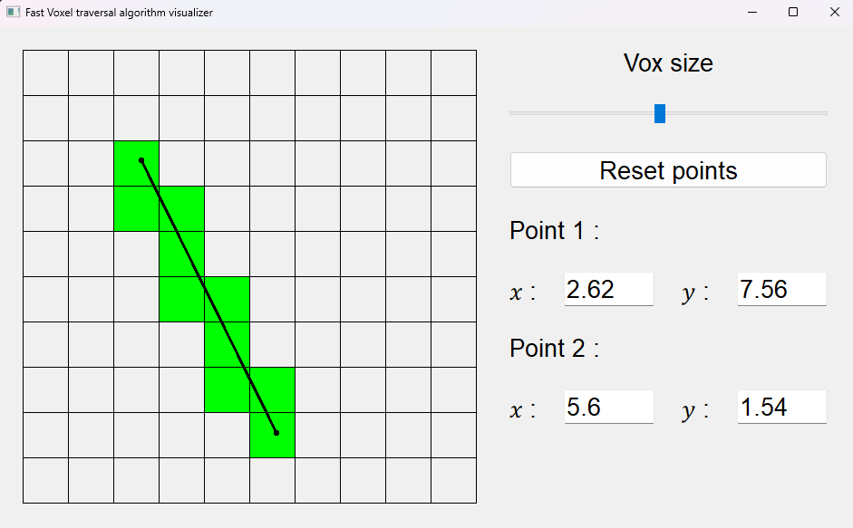

# 2D Fast Voxel Traversal Algorithm Visualizer & Multi-Dimensional

## 🔍 Overview 

This educational tool allows to play around with the Fast Voxel Traversal Algorithm [[1]](#ref). 
User places 2 points either by clicking on the grid or by setting the coordinates.
Voxes crossed by the segment thus defined get colored in green.

Grid size can be ajusted to have more or less voxes.
Coordinates follow mathematical standards : (0;0) is at the bottom left.

The visualizer applies the algorithm in 2D, it can be manually called for any dimension.

## 📕 References

[1] [Amanatides & Woo “A Fast Voxel Traversal Algorithm For Ray Tracing”](https://www.researchgate.net/publication/2611491_A_Fast_Voxel_Traversal_Algorithm_for_Ray_Tracing)